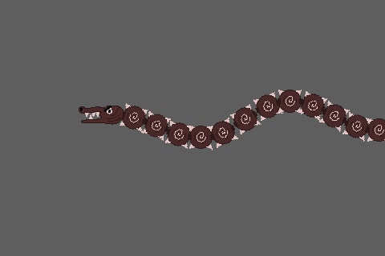

I will progressively comment and post every example I made for Construct 2 and 3 and have them available for download here.

***
[C2-1]: ./construct2/2InstancesCollision.capx

##Construct 2:
| Thumbnail  |Name | Description  | 
|---|---|---|---|
|  | [2InstancesCollision][C2-1]  | An example showing how to manage collisions between two examples of the same type |

***

[C3-1]: ./construct3/DURAGON.c3p

##Construct 3:
| Thumbnail  | Name | Description  | 
|---|---|---|---|
|  | [DURAGON][C3-1]  | A cool animated dragon made using linear interpolation and the sine behavior |